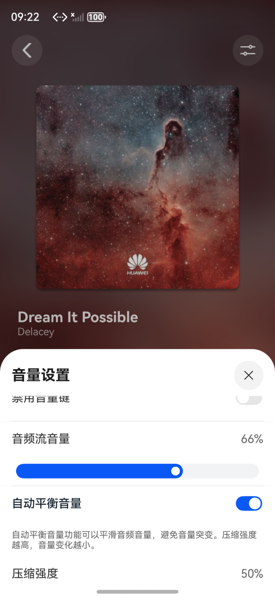

# 音频流音量管理

## 项目简介

此项目基于华为的官方演示代码的[音频流音量管理](https://gitcode.com/HarmonyOS_Samples/audio-volume-management)进行开发

本案例展示如何获取音量、设置音量、使用手势调节音量、自定义音量面板、屏蔽音量键以及自动平衡音量功能。


## 效果预览


## 使用说明
1. 安装进入应用。
2. 进入播放页后，点击播放按钮播放音乐。点击右上角图标进入音量设置：
   - 点击禁用音量键的开关组件可禁用系统音量键
   - 滑动音频流音量的滑动条可增大或减小音乐的音量
   - 启用自动平衡音量功能可以平滑音频音量，避免突然变化
   - 调整压缩强度可以控制平衡效果的强弱

## 工程目录

```
├──entry/src/main/ets/
│  ├──common                           // 各模块组件
│  │  └──CommonConstants.ets           // 常量类
│  ├──components                       // 各模块组件
│  │  ├──AVVolumePanelView.ets         // 系统音量条组件
│  │  ├──ControlAreaComponent.ets      // 播控区域组件
│  │  ├──SystemVolumePanelView.ets     // 自定义系统音量条组件
│  │  └──VolumePanelView.ets           // 自定义音量条组件
│  ├──entryability
│  │  └──EntryAbility.ets              // Ability的生命周期回调内容
│  ├──entrybackupability
│  │  └──EntryBackupAbility.ets        // EntryBackupAbility的生命周期回调内容
│  ├──model                        
│  │  └──SongData.ets                  // 歌曲实体
│  ├──pages
│  │  ├──Index.ets                     // 首页                             
│  │  └──Player.ets                    // 播放页
│  ├──player                             
│  │  ├──AudioRendererController.ets   // AudioRenderer播放控制
│  │  └──AudioVolumeController.ets     // AudioVolumeManager音量管理
│  ├──utils
│  │  ├──ColorTools.ets                // 背景颜色工具类
│  │  ├──Logger.ets                    // 日志工具类
│  │  └──MediaTools.ets                // 媒体工具类
│  └──viewModel
│     └──PlayerViewModel.ets           // 播放页数据
└──entry/src/main/resources            // 应用静态资源目录
```

## 具体实现
1. 通过audioVolumeManager管理系统音量，滑动自定义音量条，调节系统音量大小，监听系统音量变化。
2. 通过audioRenderer管理音频流音量，滑动音频流音量条，调节音频流音量大小。
3. 通过注册inputConsumer.on('keyPressed')，拦截音量键。
4. 通过自动平衡音量功能，动态压缩音频音量，避免音量突然变化，提供更平滑的听觉体验。

## 相关权限

不涉及

## 依赖

不涉及

## 约束与限制

1. 本示例仅支持标准系统上运行，支持设备：华为手机。
2. HarmonyOS系统：HarmonyOS 6.0.0 Release及以上。
3. DevEco Studio版本：DevEco Studio 6.0.0 Release及以上。
4. HarmonyOS SDK版本：HarmonyOS 6.0.0 Release SDK及以上。